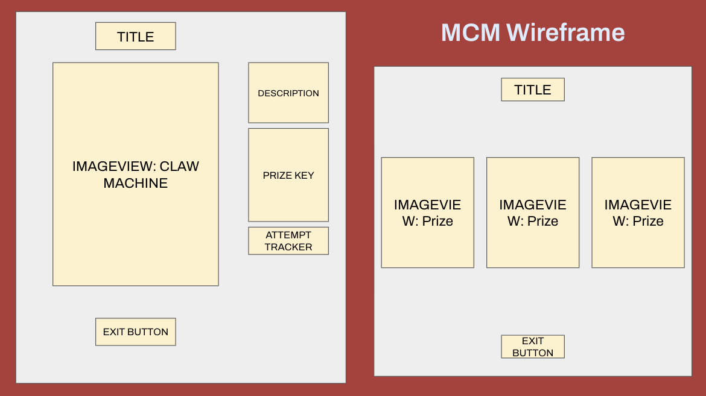

## **Movie Claw Machine:**

Description: For my project, I was inspired by a YouTube video titled, "How this Japanese Doll Broke the Toy Industry," by Answer in Progress. 
The video is about the rise in popularity of blind toy boxes, and how it relates to gambling. 
The YouTuber created a claw machine game of their own in order to understand people's interest in blind boxes. 
However, my claw machine game is about film genres, so users can grab at least 3 movie characters.

## **Preview of Movie Claw Machine:**

